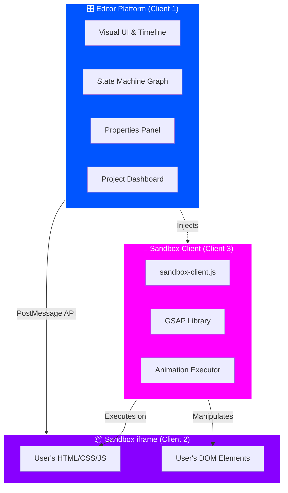

<div align="center">

# 🎬 GSAP GUI Editor

### *A Professional Animation Editor for the Modern Web*

[](https://react.dev/)
[](https://www.typescriptlang.org/)
[](https://gsap.com/)
[](https://vitejs.dev/)

*Create stunning, professional-grade animations with an intuitive visual interface powered by GSAP*

[Features](#-features) • [Architecture](#-architecture) • [Quick Start](#-quick-start) • [Tech Stack](#-tech-stack) • [Documentation](#-documentation)

</div>

---

## 🏗️ Architecture

### The Dual-Client System

<div align="center">

```
┌──────────────────────────────────────────────────────────────────────┐
│                                                                      │
│                      🖥️  GSAP GUI EDITOR                             │
│                                                                      │
└──────────────────────────────────────────────────────────────────────┘
```

</div>

The GSAP GUI Editor operates as a sophisticated **three-layer architecture** that maintains security while providing a seamless animation editing experience:

<table>
<tr>
<td width="33%" align="center">

### 🎛️ **Client 1: The Editor**
*The Platform*

The sophisticated SPA that users interact with directly

</td>
<td width="33%" align="center">

### 📦 **Client 2: The Sandbox**
*The User's Code*

A sandboxed `<iframe>` running untrusted user code

</td>
<td width="33%" align="center">

### 🤖 **Client 3: Sandbox Client**
*The Agent*

Lightweight JS injected into the sandbox to control animations

</td>
</tr>
</table>

<br>

<div align="center">



</div>

<br>

#### 🔐 **Security Through Isolation**

<table>
<tr>
<td width="50%">

**The Problem**
- Users upload untrusted HTML/CSS/JS code
- Need to preview and animate their code
- Can't let untrusted code access platform internals
- Must prevent XSS and other attacks

</td>
<td width="50%">

**The Solution**
- Sandbox runs in isolated `<iframe>`
- PostMessage API for controlled communication
- GSAP injected only when needed
- Platform code never exposed to user code

</td>
</tr>
</table>

#### 🔄 **How It Works**

```typescript
// 1️⃣ User uploads their code
const userCode = `<div class="box">Hello World</div>`;

// 2️⃣ Platform loads it in sandboxed iframe
sandbox.src = createBlobURL(userCode);

// 3️⃣ Platform injects sandbox-client.js
injectScript('sandbox-client.js');

// 4️⃣ User creates animation in timeline
timeline.to('.box', { x: 100, duration: 1 });

// 5️⃣ Platform sends command via PostMessage
window.postMessage({
  type: 'ANIMATE',
  target: '.box',
  properties: { x: 100, duration: 1 }
}, '*');

// 6️⃣ Sandbox client executes GSAP animation
gsap.to('.box', { x: 100, duration: 1 });
```

<div align="center">

**🎯 Result: Secure, isolated animation editing with zero platform exposure**

</div>

---

## ✨ Features

<table>
<tr>
<td width="50%">

### 🎨 **Modern Design System**
- Custom CSS variables & tokens
- 8px grid-based spacing
- Dark theme optimized for long sessions
- Inter font typography system
- Glassmorphic UI elements

</td>
<td width="50%">

### ⚡ **Lightning Fast**
- Vite-powered development
- Hot Module Replacement (HMR)
- Optimized production builds
- Sub-second page loads
- Lazy loading & code splitting

</td>
</tr>
<tr>
<td width="50%">

### 🎭 **Professional Animations**
- GSAP 3.13 integration
- Timeline-based editing
- Keyframe management
- Custom animation hooks
- Real-time preview in sandbox

</td>
<td width="50%">

### 🔄 **State Management**
- XState state machines
- Predictable state flows
- Visual workflow editor
- ReactFlow node system
- Time-travel debugging

</td>
</tr>
<tr>
<td width="50%">

### 🔐 **Secure Sandbox**
- Isolated iframe execution
- PostMessage communication
- CSP-compliant architecture
- No direct code access
- XSS protection

</td>
<td width="50%">

### 🌐 **Full-Stack Ready**
- Supabase backend integration
- Row-level security (RLS)
- Real-time database sync
- Authentication & authorization
- Cloud storage for projects

</td>
</tr>
</table>

---

## 🚀 Quick Start

### Prerequisites

```bash
Node.js 18+  ✓
npm/yarn/pnpm  ✓
```

### Installation

```bash
# 1️⃣ Clone the repository
git clone https://github.com/yourusername/GSAP-GUI.git
cd gsap-editor

# 2️⃣ Install dependencies
npm install

# 3️⃣ Set up environment (optional but recommended)
cp env.template .env
# Edit .env with your Supabase credentials
```

### Development

```bash
# Start the dev server with HMR
npm run dev

# 🌐 Open http://localhost:5173
```

### Build for Production

```bash
# Create optimized build
npm run build

# Preview production build
npm run preview
```

### Testing

```bash
# Run all tests
npm test

# Run tests in CI mode
npm run test:run

# Run with UI
npm run test:ui
```

**Test Setup:**
1. Copy `env.test.template` → `.env.test`
2. Add Supabase credentials (including service role key)
3. See `supabase/tests/README.md` for details

---

## 🛠️ Tech Stack

<div align="center">

| Layer | Technology | Purpose |
|-------|-----------|---------|
| **Frontend** | React 19 + TypeScript | Type-safe UI components |
| **Build Tool** | Vite 7 | Lightning-fast dev experience |
| **Animations** | GSAP 3.13 | Professional animation engine |
| **State** | XState 5 | Predictable state machines |
| **Workflows** | ReactFlow 11 | Visual node editor |
| **Backend** | Supabase | Auth, database, storage |
| **Routing** | React Router 7 | Client-side navigation |
| **Testing** | Vitest + Testing Library | Unit & integration tests |
| **Code Quality** | ESLint + TypeScript | Linting & type checking |

</div>

### Core Dependencies

```json
{
  "react": "^19.1.1",
  "react-dom": "^19.1.1",
  "gsap": "^3.13.0",
  "xstate": "^5.24.0",
  "@xstate/react": "^6.0.0",
  "reactflow": "^11.11.4",
  "@supabase/supabase-js": "^2.78.0",
  "react-router-dom": "^7.9.5"
}
```

---

## 📁 Project Structure

```
gsap-editor/
├── 📱 src/
│   ├── 🧩 components/          # Reusable React components
│   │   ├── Button/             # Primary/secondary button styles
│   │   ├── Sandbox/            # Isolated iframe component
│   │   ├── HighlightOverlay/   # Visual element highlighting
│   │   ├── InspectorOverlay/   # DOM inspector UI
│   │   └── ProtectedRoute.tsx  # Auth guard component
│   │
│   ├── 🪝 hooks/               # Custom React hooks
│   │   ├── useGSAPAnimation.ts # GSAP animation manager
│   │   └── usePostMessage.ts   # Sandbox communication
│   │
│   ├── 📄 pages/               # Route pages
│   │   ├── EditorPage.tsx      # Main editor interface
│   │   ├── LoginPage.tsx       # Authentication page
│   │   └── TestPage.tsx        # Development testing page
│   │
│   ├── 🎨 styles/              # Global styles
│   │   ├── index.css           # Design system tokens
│   │   └── App.css             # App-specific styles
│   │
│   ├── 🔧 utils/               # Helper functions
│   │   ├── supabaseClient.ts   # Supabase SDK setup
│   │   └── index.ts            # Utility exports
│   │
│   ├── 📝 types/               # TypeScript definitions
│   │   └── index.ts            # Shared type definitions
│   │
│   └── 🌐 contexts/            # React contexts
│       └── AuthContext.tsx     # Authentication state
│
├── 🔒 public/
│   └── sandbox-client.js       # Injected sandbox agent
│
├── 🗄️ supabase/
│   ├── migrations/             # Database migrations
│   └── tests/                  # Supabase RLS tests
│
├── ⚙️ Configuration Files
│   ├── vite.config.ts          # Vite configuration
│   ├── vitest.config.ts        # Test configuration
│   ├── tsconfig.json           # TypeScript config
│   └── eslint.config.js        # Linting rules
│
└── 📚 Documentation
    ├── README.md               # This file
    ├── MCP_SETUP.md            # MCP server setup guide
    ├── SUPABASE_QUICKSTART.md  # Quick Supabase setup
    └── TESTING_SETUP.md        # Testing documentation
```

---

## 🎨 Design System

Our design system is built with modern CSS custom properties, optimized for dark interfaces and long editing sessions.

### 🎨 Color Palette

<table>
<tr>
<td width="25%">

**Primary**
```css
--blue: #0055FF
--black: #000000
--white: #FFFFFF
```

</td>
<td width="25%">

**Accents**
```css
--pink: #FF00FF
--purple: #8800FF
--green: #00CC99
```

</td>
<td width="50%">

**Grays**
```css
--gray-100: #F5F5F5  /* Lightest */
--gray-300: #DDDDDD  /* Borders */
--gray-500: #A6A6A6  /* Icons */
--gray-600: #808080  /* Secondary text */
--gray-800: #333333  /* Primary text */
--gray-900: #1A1A1A  /* Darkest */
```

</td>
</tr>
</table>

### 📝 Typography

```css
/* Headings */
.h1, h1 { font-size: 4rem; font-weight: 700; letter-spacing: -0.03em; }
.h2, h2 { font-size: 2.25rem; font-weight: 700; letter-spacing: -0.015em; }
.h3, h3 { font-size: 1.5rem; font-weight: 600; }
.h4, h4 { font-size: 1.125rem; font-weight: 600; }

/* Body Text */
.text-large { font-size: 1.25rem; line-height: 1.6; }
.text-body, p { font-size: 1.0625rem; line-height: 1.6; }
.text-small { font-size: 0.875rem; line-height: 1.4; }
.text-caption { font-size: 0.75rem; line-height: 1.3; }
```

### 📐 Spacing System

8px grid-based spacing for consistent layouts:

```css
--space-1: 4px    --space-6: 24px   --space-16: 64px
--space-2: 8px    --space-8: 32px   --space-20: 80px
--space-3: 12px   --space-10: 40px  --space-24: 96px
--space-4: 16px   --space-12: 48px
--space-5: 20px
```

### 🔘 Border Radius

```css
--radius-small: 4px    /* Subtle corners */
--radius-medium: 8px   /* Cards, inputs */
--radius-large: 12px   /* Panels, modals */
--radius-full: 9999px  /* Buttons, pills */
```

> 💡 All design tokens are defined in `src/index.css`

---

## 📚 Documentation

### Custom Hooks

#### `useGSAPAnimation`

Manage GSAP animations with React lifecycle:

```typescript
import { useGSAPAnimation } from './hooks';

function AnimatedComponent() {
  const { animate, timeline, kill } = useGSAPAnimation();
  
  const handleClick = () => {
    animate('.box', {
      x: 100,
      rotation: 360,
      duration: 1
    });
  };
  
  return <button onClick={handleClick}>Animate</button>;
}
```

#### `usePostMessage`

Communicate with the sandbox iframe:

```typescript
import { usePostMessage } from './hooks';

function Editor() {
  const { sendMessage, addListener } = usePostMessage(iframeRef);
  
  // Send animation command to sandbox
  sendMessage({
    type: 'ANIMATE',
    target: '.element',
    properties: { x: 100 }
  });
  
  // Listen for responses
  addListener('ANIMATION_COMPLETE', (data) => {
    console.log('Animation finished', data);
  });
}
```

### Components

#### `<Sandbox />`

Isolated iframe component for running user code:

```typescript
<Sandbox
  html={userHTML}
  css={userCSS}
  js={userJS}
  onLoad={handleLoad}
  onMessage={handleMessage}
/>
```

#### `<HighlightOverlay />`

Visual overlay for highlighting DOM elements:

```typescript
<HighlightOverlay
  target={selectedElement}
  color="rgba(0, 85, 255, 0.3)"
/>
```

---

## 🔧 Configuration

### Supabase Setup

This project uses Supabase for backend services:

<table>
<tr>
<td width="50%">

**Quick Start** (5 minutes)
1. Create account at [supabase.com](https://supabase.com)
2. Create new project
3. Copy URL and anon key
4. Create `.env` from `env.template`
5. Paste credentials

</td>
<td width="50%">

**Detailed Setup**
- 📖 [SUPABASE_QUICKSTART.md](./SUPABASE_QUICKSTART.md)
- 🔧 [MCP_SETUP.md](./MCP_SETUP.md)
- 🧪 [TESTING_SETUP.md](./TESTING_SETUP.md)

</td>
</tr>
</table>

```bash
# Quick setup
cp env.template .env
# Edit .env with your credentials

# For testing
cp env.test.template .env.test
# Add service role key for RLS tests
```

### Available Scripts

| Command | Description |
|---------|-------------|
| `npm run dev` | Start dev server with HMR at http://localhost:5173 |
| `npm run build` | Build optimized production bundle |
| `npm run preview` | Preview production build locally |
| `npm test` | Run tests in watch mode |
| `npm run test:run` | Run tests once (CI mode) |
| `npm run test:ui` | Open Vitest UI for debugging |
| `npm run lint` | Run ESLint on codebase |

---

## 🧪 Testing

We use **Vitest** + **React Testing Library** for comprehensive testing:

```bash
# Run all tests
npm test

# Run specific test file
npm test -- editor-workflow

# Run with coverage
npm test -- --coverage

# Open test UI
npm run test:ui
```

### Test Structure

```
src/__tests__/
├── integration/
│   ├── editor-workflow.test.tsx    # Full user workflows
│   └── sandbox-communication.test.ts # PostMessage tests
│
└── components/
    ├── Sandbox.test.tsx
    ├── HighlightOverlay.test.tsx
    └── InspectorOverlay.test.tsx
```

---

## 🤝 Contributing

We welcome contributions! Here's how to get started:

1. **Fork** the repository
2. **Clone** your fork: `git clone https://github.com/your-username/GSAP-GUI.git`
3. **Create** a branch: `git checkout -b feature/amazing-feature`
4. **Make** your changes
5. **Test** your changes: `npm test`
6. **Commit**: `git commit -m 'Add amazing feature'`
7. **Push**: `git push origin feature/amazing-feature`
8. **Open** a Pull Request

### Development Guidelines

- ✅ Write tests for new features
- ✅ Follow existing code style
- ✅ Update documentation
- ✅ Keep commits atomic and descriptive
- ✅ Ensure all tests pass before PR

---

## 🔒 Security

### Reporting Vulnerabilities

If you discover a security vulnerability, please email us at security@gsapgui.dev instead of opening a public issue.

### Security Features

- 🔐 **Sandbox Isolation**: User code runs in isolated iframe
- 🔐 **CSP Headers**: Content Security Policy prevents XSS
- 🔐 **RLS Policies**: Row-level security in Supabase
- 🔐 **Input Validation**: All user input is sanitized
- 🔐 **PostMessage Origin Checks**: Strict origin validation

---

## 📈 Roadmap

- [ ] **Timeline Editor**: Visual GSAP timeline editing
- [ ] **Keyframe Inspector**: Frame-by-frame animation control
- [ ] **State Machine Graph**: Visual XState editor
- [ ] **Export Animations**: Export as code or video
- [ ] **Collaboration**: Real-time multi-user editing
- [ ] **Templates**: Pre-built animation templates
- [ ] **Plugin System**: Extend with custom plugins
- [ ] **Cloud Sync**: Save projects to Supabase
- [ ] **Version Control**: Track animation changes

---

## 🙏 Acknowledgments

Built with amazing open-source tools:

<table>
<tr>
<td align="center" width="20%">

<br>
<strong>GSAP</strong>
<br>
Professional animations
</td>
<td align="center" width="20%">

<br>
<strong>React</strong>
<br>
UI library
</td>
<td align="center" width="20%">

<br>
<strong>XState</strong>
<br>
State machines
</td>
<td align="center" width="20%">

<br>
<strong>Supabase</strong>
<br>
Backend platform
</td>
<td align="center" width="20%">

<br>
<strong>Vite</strong>
<br>
Build tool
</td>
</tr>
</table>

---

## 📄 License

This project is licensed under the MIT License - see the [LICENSE](LICENSE) file for details.

---

<div align="center">

### ⭐ Star this repo if you find it helpful!

**Built with ❤️ by the GSAP GUI Team**

[Report Bug](https://github.com/yourusername/GSAP-GUI/issues) • [Request Feature](https://github.com/yourusername/GSAP-GUI/issues) • [Documentation](https://github.com/yourusername/GSAP-GUI/wiki)

</div>
